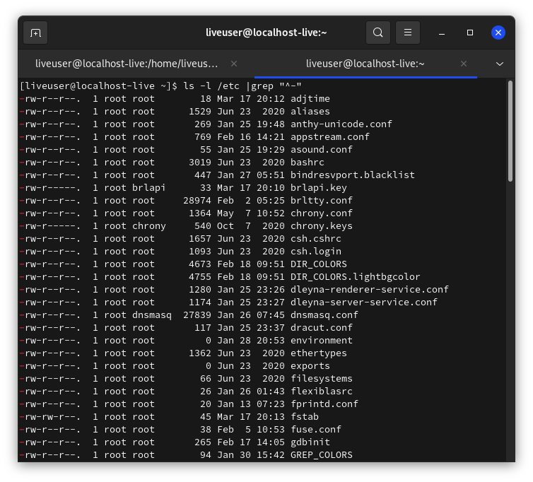

# Строение Linux - часть 2. Принцип "всё есть файл", виды файлов.

В первой части статьи речь была об общем строении системы. Так сказать, галопом по европам. А в следующих частях строение Linux будет описано подробнее. Каждая статья описывает только одну тему.

Для начала стоит написать о концепции "всё есть файл". Концепция была перенята разработчиками Linux из Unix. Это было сделано для предоставления простого доступа ко всем возможностям ОС не разрабатывая отдельных костылей. Т.е., преимущество такого принципа в том, что не надо реализовывать отдельный API для каждого устр-ва, в результате чего с ним (с файлом) могут работать все стандартные программы и API-интерфейсы. В Linux есть `корневая ФС` (корневая файловая система), куда монтируются раздел жёсткого диска, где установлена система, другие разделы, флешки, диски, псевдо-ФС и пр. Посмотрите на файл `/etc/os-release`:
```
file /etc/os-release
```


Самое яркое представление этого принципа - устройства. Просмотрите содержимое каталога /dev:
```
ls /dev |less
```

В этот каталог подключаются все устройства: флеш-карты, мыши, клавиатуры, микрофоны, жёсткие диски и пр.

А теперь просмотрите информацию о каком-нибудь файле в `/dev`:
```
file /dev/sda2
```


В этом файле находятся двоичные данные, поэтому открыть его в каком-то текстовом редакторе бесмыссленно.

Однако, самое главное достоинство Linux в том, что и в обычном файле можно создать файловую систему заместо содержимого файла. Например, тот же файл подкачки `/swapfile`. Это файл, но с ФС `swap`.

Все конфиги, находящиеся в директориях `/etc`, `~/.local`, `~/.config` - тоже файлы.

## Типы файлов
Есть 3 типа файлов:
* **Обыкновенные**, которые используются для хранения информации
* **Специальные** (для туннелей и устройств)
* **Директории** (их ещё называют *папками* или *каталогами*)

***
С обычными файлами пользователь работает чаще всего. Это документы, текстовые файлы, музыка, видео и пр.

Для того, чтобы просмотреть эти файлы, выполнить:
```
ls -l /etc |grep "^-"
```


### Объяснение команды
* `ls` просматривает каталог, а ключ `-l` добавляет отображение прав на файл. `/etc` замените на нужную директорию
* `grep "^-"` - так как "обычные" файлы обозначаются чертой (в первой колонке вывода `ls`, где отображаются права на файл), то эта команда выведет только эти файлы по маске `^-`.

***
По поводу специальных файлов. Они обеспечивают обмен информации с ядром, работу с устр-вами и пр. Собственно, делятся ещё на несколько видов:
* **Символьные файлы** - любые специальные системные, например `/dev/null`, или периферийные устр-ва (последовательные/параллельные порты). Такие файлы идентифицированы символом `c`.
* **Блочные**  - периферийные устр-ва, но в отличии от предыдущего типа, содержание блочных файлов буферизируется. Эти файлы идентифицированы символом `b`.


* **Символические ссылки** (симлинки) - указывают на другие файлы по их имени, указывают и на другие файлы, в т.ч. каталоги. Обозначены символом `l`. В выводе команды `ls -l /путь/до/директории |grep "^l"` можно увидеть, на какой файл ссылаются симлинки - в последней колонке название имеет следующий вид:
`НАЗВАНИЕ ФАЙЛА` -> `НА ЧТО ССЫЛАЕТСЯ`

* **Туннели** (каналы/именованные каналы) - очень похожи на туннели из `Shell`, но разница в том, что именованные каналы имеют название. Они очень редки. Обозначены символом `p`.

## Информация о файлах
### LSOF
Список всех открытых файлов можно просмотреть с помощью команды `lsof` - ListOpenFiles. Эта информация поможет узнать о многом происходящем в системе, об устройстве и работе Linux, а также решить проблемы, например, когда вы не можете размонтировать диск из-за того, что устройство используется, но вы не можете найти, какой именно программой.


Вывод `lsof` состоит из нескольких колонок с информацией:
* `COMMAND` - имя команды, которая открыла или использует файл
* `PID` - PID процесса
* `TID` - идентификационный номер задачи (потока) . Пустой столбец означает, что это не задача; это процесс
* `TASKCMD` - имя команды задачи. Обычно имеет то же самое название, что и процесс, названный в столбце `COMMAND`, но некоторые реализации задач (например, Linux) позволяют задаче изменить имя своей команды
* `USER` - имя пользователя, которому соответствует процесс, либо тот пользователь, которому принадлежит директория `/proc`, откуда lsof берёт информацию о процессе
* `FD` - показывает файловый дескриптор файла
* `TYPE` - тип узла, связанного с файлом
* `DEVICE` - содержит номера устройств, разделённые запятыми, для специальных символьных, специальных блочных, обычных файлов, каталогов или NFS. Также может отображаться базовый адрес или имя устройства с сокетом Linux AX.25
* `SIZE/OFF` - размер файла/смещение файла в байтах
* `NODE` - показывает номер узла локального файла или номер узла NFS-файла на хосте сервера или тип интернет-протокола. Может отображаться STR для потока, IRQ или номер инода устройства с сокетом Linux AX.25
* `NAME` - имя имя точки монтирования и файловой системы, в которой находится файл

### Опции lsof
* `-u` - список файлов, открытых конкретным пользователем. Например, список открытых фалов пользователем `liveuser`:
```
lsof -u liveuser
```


* `-U` - вывести все файлы сокетов домена Unix


* `+d` - выяснить, какие папки и файлы открыты в некоей директории (но не в её поддиректориях): `lsof +d /usr/bin`
* `-d` - задать список дескрипторов файлов, разделённых запятой, которые надо включить в вывод или исключить из него

> Список исключается из вывода, если все записи в наборе начинаются со знака `^`. Список будет включён в вывод, если ни одна запись не начинается с `^`. Смешивание записей разных видов не разрешается.

> В списке может присутствовать диапазон номеров дескрипторов файлов при условии, что ни один из его членов не пуст, оба члена являются числами, и завершающий член больше начального - то есть: «0-7» или «3-10».

> Диапазоны могут быть использованы для исключения записей из вывода, если перед ними стоит префикс `^`, то есть - `^0-7` исключает все дескрипторы с 0 по 7.

* `-p` - вывести все файлы, открытые процессом с указанным при вызове команды PID
* И другие ключи. Перечислять их всех я не вижу смысла. Зайдите [сюда](https://habr.com/ru/company/ruvds/blog/337934/), чтобы узнать больше. И, конечно же, `man lsof`.
